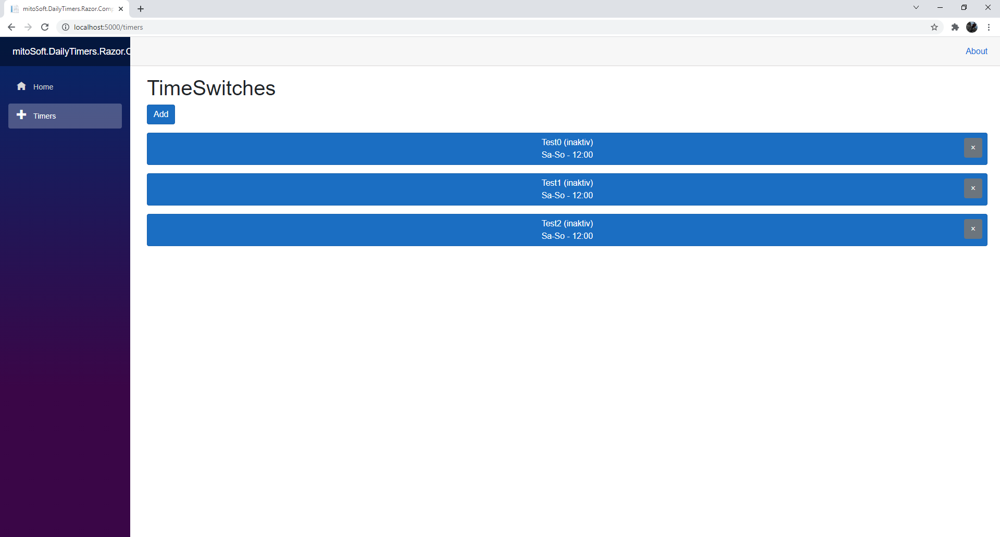

# mitoSoft.Razor.DailyTimers.Components

This library provides a bunch of rozor controsl to handle the daily-timers of **mitoSoft.DailyTimers.Core**.

## Dependencies

 - Microsoft.AspNetCore.Components.Web (5.0.12)
 - mitoSoft.DailyTimers.Core (1.1.1)
 - mitoSoft.Razor.Components (1.1.0)

## DailyTimeView 
This control provides short overview to depict teh information of a **IDailyTimer** interface in a quick and easy manner. 
Furthermore it comes with a remove, a update and a select event to handel the timer appropriately in the calling component
It could be embedded as follows:

```c#

  @foreach (var timer in this.Timers.SortByName())
  {
    <p>
      <DailyTimerView OnTimerRemoved="@OnTimerRemoved" OnTimerUpdated="@OnTimerUpdated" Timer="@timer"></DailyTimerView>
    </p>
  }

```

It looks like follows:



## EditDailyTimerModal
This control is also build as modal control and provides all necessarily user controls elements to edit a IDailyTimer interface.
It is callable synchronously via **ShowDialog()** and asynchronously via **Show()**.

It looks like follows:


The complete example usage via a server-side blazor project can be found in the [ExampleProject](mitoSoft.Razor.DailyTimers.Components.ExampleUsageInBlazorServer).
